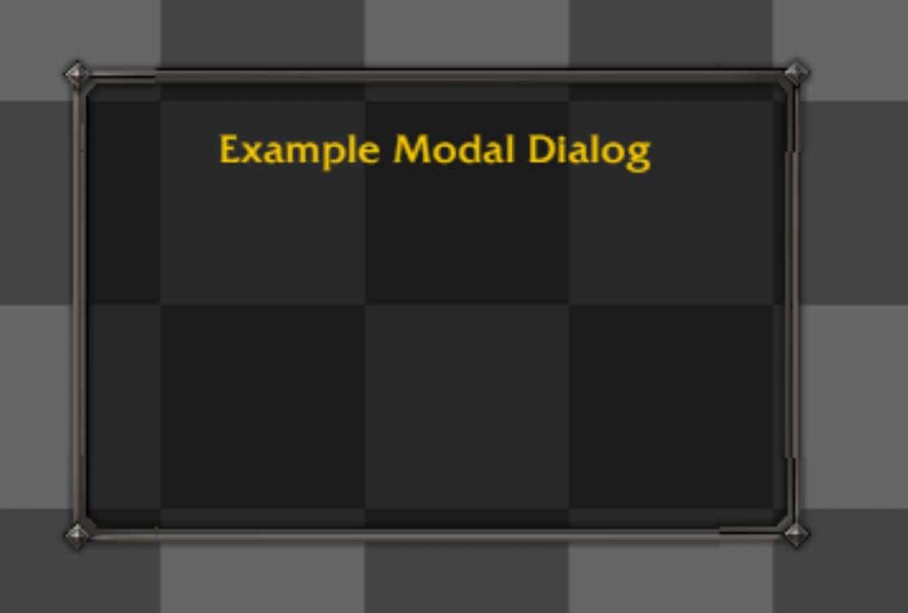
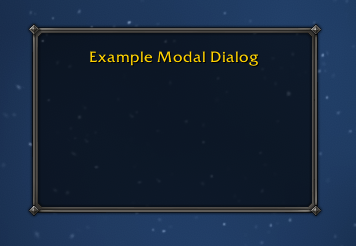

# Modal Dialog Border Misrendering

## The Problem

The top and bottom middle edge segments (`TopEdge` and `BottomEdge`) of the Modal Dialog (`DialogBorderTemplate`) are occupying their correct physical layout bounds, but their internal textures fail to render properly. Depending on the code iteration, the borders have appeared completely invisible, replaced by fallback placeholder textures, or severely stretched horizontally with broken vertical alignment between corners and edges.

### Visual Comparison

**Misrendered Border (The Problem)**  
Notice how the borders show up, but they are misrendered or disjointed across the corners:

**Expected Rendering**  
The `DiamondMetal` border should cleanly flow two gray lines with a black line horizontally between the star-knob corners:

---

## Root Cause Analysis

The fundamental issue involves how the `DiamondMetal` atlas is processed.

1. **Fractional Coordinates:** The atlas has a scale divisor of `4`. When the raw coordinates (like `y=131`) are divided, it results in fractional offsets (e.g., `32.75`).
2. **Dual Rendering Paths:** Scryer uses two different paths for border pieces:
   - **Synchronous CSS (Path A):** Rounds coordinates for `background-position` and uses CSS to stretch/crop. This is used by the corners.
   - **Async Canvas Extraction (Path B):** Extracts repeating sub-regions to a `<canvas>` fallback for elements that need `repeat-x` tiling. This is used by `TopEdge` and `BottomEdge`.

Because Path A and Path B handle rounding of these fractional coordinates differently, the extracted Canvas image shifts by ~1 physical pixel compared to the CSS corner image. This leads to the disjointed seams and misaligned gray lines across the border edges.

---

## What Was Tried (and Why It Failed)

Several attempts were made to fix the canvas extraction pipeline, many of which led to full regressions, invisible textures, or CORS errors. If you want to review the exact commits and logic that were attempted, they are preserved on the `experimental-modal-fixes-2026-06-07` branch.

### 1. Canvas Fallback with CORS (`img.crossOrigin = "anonymous"`)

- **Attempt:** The initial canvas fallback tried to load the sprite sheet into an image and draw it to a canvas to handle repeating tiles. To prevent "tainting" the canvas (which blocks `toDataURL` extraction), `img.crossOrigin = "anonymous"` was used.
- **Result:** **Major Regression.** This triggered CORS errors because VS Code Webview `vscode-webview-resource:` URIs do not support cross-origin requests cleanly.
- **Visual Impact:** The canvas threw a `SecurityError` and extraction failed silently. Textures disappeared entirely or became placeholders.

### 2. Blob Fetch Bypass

- **Attempt:** To bypass the CORS tainting, the code was rewritten to use `fetch()` to download the image as a Blob, followed by `URL.createObjectURL(blob)` to feed the image to the canvas safely.
- **Result:** **Silent CSP Block.** The canvas successfully drew the image and generated a base64 `data:image/png` URL without throwing security errors. However, the VS Code Webview Content Security Policy (CSP) lacked `data:` in its `img-src` directive, so the browser silently blocked the injected background image.

### 3. Aspect Ratio and Canvas Scaling

- **Attempt:** Once the CSP block was fixed, the canvas extracted the sprite, but it miscalculated the CSS `backgroundSize`. It used the physical unscaled pixel dimensions of the crop instead of the scaled logical dimensions.
- **Result:** The repeating texture stretched horizontally by 4x, making it visibly distorted.

### 4. Tightening Canvas Fallback Conditions

- **Attempt:** We tried restricting the `needsCanvasH` and `needsCanvasV` logic so that only tiles that tile in _both_ horizontal and vertical dimensions would use the canvas extraction fallback.
- **Result:** **Regression.** This completely broke `TopEdge` for the Modal Dialog (which only tiles horizontally) because the fallback was no longer applied. However, this approach _did_ work for `TitleFrame`, leading to confusion over why one frame's edges rendered correctly with CSS stretch-to-fill and another frame's edges required canvas extraction.

---

## Conclusion

The edge piece rendering bug exposed multiple friction points in the webview's asset pipeline—namely VS Code CORS restrictions, Webview CSP policies, and sub-pixel rounding mismatches between `<canvas>` drawing and CSS `background-position`. For full details on the final fixes and the pixel-by-pixel tests, see the implementation notes on the `experimental-modal-fixes-2026-06-07` branch.
