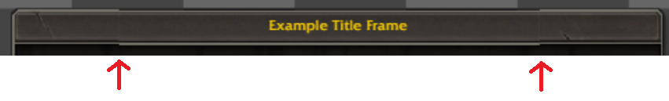

# NineSlice border misalignment at non-1x DPR

**Symptoms:** Title bar top and/or bottom border bands visually misaligned between corner pieces and edge pieces at non-1x DPR (e.g. 1.82x). Corners appear darker/correct; middle edge appears ~0.5-1 CSS px shifted, revealing a ~4-5px lighter or shifted band. Headless tests at 1x DPR pass.

**Affected template:** `DefaultPanelTemplate` (and any NineSlice frame using `tilesH && !tilesV` edge pieces).

---

## Visual progression

**Partial improvement — top, bottom, and separation all wrong:**

**After Fix 2+3 — bottom border fixed, top border and separation still wrong:**

**After Fix 4 — top border fixed, separation remains (may be acceptable for a rough preview):**

---

## Root cause 1 — fractional `background-position` (bottom border)

`background-position-y` was computed as a raw float (e.g. `-0.5px`). At non-integer DPR, `-0.5 CSS px = -0.91 device px`. Chromium rounds this differently depending on `background-repeat` mode: the `repeat` tile-fit path snaps to -1 device px; the `no-repeat` path may render sub-pixel. This misaligns tiles sharing the same logical position.

**Fix:** Round `background-position` values to integer px before assignment. See `main.ts` Fix 2, committed in `240ee9a`.

---

## Root cause 2 — Chromium phase-snap on `repeat-x` (top border)

After fixing the fractional position, the bottom border aligned but a top-border mismatch appeared.

**Key discovery:** Chromium's `background-repeat: repeat` path (including `repeat-x`) runs a **tile-fit phase-snap on ALL axes** during device-pixel mapping — even the axis not repeating. `background-repeat: no-repeat` does not snap. This means:

- Corner pieces (`no-repeat no-repeat`): atlas row rendered at device sub-pixel precision (e.g. device y = 464.10).
- Edge pieces (`repeat-x`): Y origin snapped to nearest device px (e.g. device y = 463.94 → snapped to 464 then offset = 463.94).

At 1.82x DPR a 0.16 device-px difference shifts which blend of the semi-transparent gradient rows (α = 23–60%) falls on each device row. Combined with a metallic background layer (`TopTileStreaks`) present behind the middle section but not corners, the edge appears visibly lighter for ~4-5 CSS px at the top.

**Fix:** For `tilesH && !tilesV` pieces (h-only tiles), stretch one tile instance to fill element width (`scaleX = elemW / crop.width`) and use `no-repeat no-repeat`. Since the edge tile is x-uniform (a pure y-gradient), this is visually identical to tiling but puts the edge on the same Chromium render path as corners — no phase-snap on either axis. CSS clips background overflow to element bounds automatically. See `main.ts` Fix 4, committed in `8dcf260`.

---

## Investigation path

1. Noticed top/bottom border mismatch in live VS Code view only (not headless 1x tests).
2. Identified non-1x DPR as the differentiator.
3. Probed atlas data: confirmed `TopEdge` tile is x-uniform (pure y-gradient) — ruling out content difference.
4. Confirmed CSS math identical for corner vs edge at elemH=75: same `bgPosY`, same `bgH`, same first-content row. Bug must be in rendering, not layout.
5. Bisected repeat mode: switching edge from `repeat-x` to `no-repeat` aligned the top. Traced root cause to Chromium's per-axis phase-snap behavior on repeat paths.

---

## Tests added

- `top-row NineSlice background-position-y is integer` — guards Fix 2 (no fractional position).
- `horizontal-only NineSlice tiles use no-repeat (stretch-to-fill)` — guards Fix 4 (h-only = stretch + `no-repeat no-repeat`, `bgSizeW >= elemW`).
- Pixel-color assertions at known corner/edge coordinates for top and bottom border rows.
