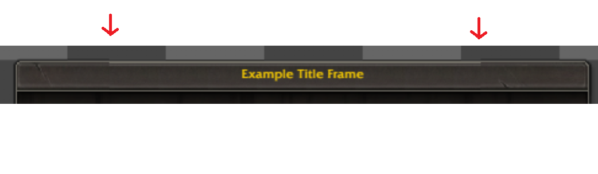
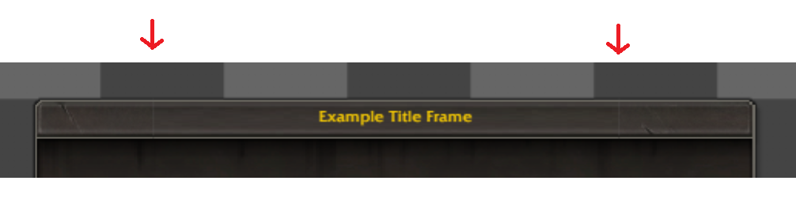
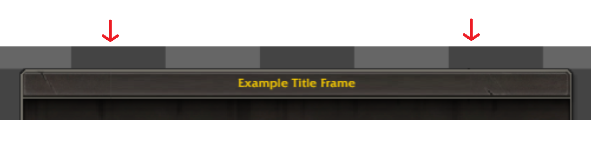

# NineSlice border misalignment at non-1x uiScale

**Symptoms:** Title bar border visually misaligned between corner pieces and edge pieces
at non-integer uiScale (e.g. 1.875× at 3440×1440). Headless tests at 1× (1024×768) pass.

**Affected template:** `DefaultPanelTemplate` (and any NineSlice frame using `tilesH && !tilesV`
edge pieces: TopEdge, BottomEdge).

**Why headless tests miss it:** uiScale = screenHeight / 768. At 1024×768, uiScale = 1.0 —
all CSS positions are integers in viewport space. At 3440×1440, uiScale = 1.875 — integer CSS
positions (e.g. x=795) become fractional viewport positions (795 × 1.875 = 1490.625), exposing
Chromium sub-pixel compositing artifacts that only appear under a CSS `transform:scale`.

---

## Visual progression

**Partial improvement — top, bottom, and separation all wrong:**


**After Fix 2+3 — bottom border fixed, top border and separation still wrong:**


**After Fix 4 — top border fixed, vertical seams remain:**


**After Fix 5 — seam bleed added, right seam gone, left seam faint:**


---

## Root cause 1 — fractional `background-position` (bottom border misalignment)

`background-position-y` was computed as a raw float (e.g. `-0.5px`). At non-integer uiScale,
`-0.5 CSS px` maps to a fractional device pixel. Chromium rounds this differently depending on
`background-repeat` mode: the `repeat` tile-fit path snaps to -1 device px; the `no-repeat`
path renders sub-pixel. Corner pieces (no-repeat) and edge pieces (repeat-x) ended up at
different effective y origins, misaligning the horizontal border rows.

**Fix 2** (`240ee9a`): Round all `background-position` values to integer px before assignment
in `applyAsset()`.

---

## Root cause 2 — Chromium phase-snap on `repeat-x` (top border misalignment)

After Fix 2, bottom aligned but a top-border mismatch appeared.

Chromium's `background-repeat: repeat` path (including `repeat-x`) runs a **tile-fit phase-snap
on ALL axes** during device-pixel mapping — even on the axis that is not repeating.
`background-repeat: no-repeat` does not snap. This means:

- Corner pieces (`no-repeat`): atlas row rendered at device sub-pixel precision.
- Edge pieces (`repeat-x`): Y origin snapped to nearest device px.

At 1.875× uiScale the resulting Y offset difference shifts which blend of the semi-transparent
gradient rows (α = 23–60%) lands on each device row. Combined with a metallic background layer
(`TopTileStreaks`) behind the middle section but not the corners, the edge piece appeared
visibly lighter for ~4-5 CSS px.

**Fix 4** (`8dcf260`): For `tilesH && !tilesV` pieces, stretch one tile instance to fill the
element width (`scaleX = elemW / crop.width`, `no-repeat`). The edge tile is x-uniform (pure
y-gradient), so stretching is visually identical to tiling but puts the edge on the same
Chromium render path as corners — no phase-snap on either axis.

---

## Root cause 3 — device-pixel gap between adjacent element boxes (vertical seams)

After Fix 4, two faint vertical seam lines appeared at the TopLeft/TopEdge and TopEdge/TopRight
boundaries. Visible only at non-integer uiScale.

`#wow-logical-parent` carries `transform: scale(uiScale)`. Chromium rasterises each child
element independently before compositing, then scales the layer. At fractional uiScale, the
device-pixel extents of adjacent elements can fail to be perfectly adjacent — a 1-device-pixel
column at the seam belongs to neither element and renders as a transparent gap wherever the
NineSlice tiles are semi-transparent (the gradient area of the title bar).

A secondary contributor: `background-size` was computed as a raw float (`sheetW × elemW / cropW`).
At fractional uiScale the background could fall 1 device pixel short of the element's right edge.

**Fix 5**: Extend h-only tiles 1 CSS px left and right at layout time (`seamBleed = 1` in
`renderer.ts`). The tiles are x-uniform, so the bleed columns are visually identical to the
main content. `bgW`/`bgH` rounded to integer px in `applyAsset()` to eliminate background
underfill.

---

## Root cause 4 — transparent seam-bleed column, mixed-element device pixel (left seam)

Fix 5 introduced `bgPosX + seamBleed` to shift content rightward by 1px, leaving element x=0
of TopEdge transparent. This meant atlas content still started at CSS x = TopLeft.right — the
exact fractional viewport boundary. The device pixel straddling TopLeft.right × 1.875 blended
~62% TopLeft with ~37% TopEdge content. When the two atlas sources differ at that column the
blend is visible as a hairline seam. (The right seam was less affected because TopEdge's 1px
right bleed overlapped into TopRight's territory, which is then covered by TopRight rendering
on top.)

**Fix 6**: Remove `+ seamBleed` from `bgPosX`. Content starts at element x=0 — i.e. 1 CSS px
left of TopLeft.right. Because edge pieces are added after corner pieces in the NineSlice setup
loop, they render on top of corners in DOM order. The overlap pixel is covered by TopEdge
content, and the device pixel straddling TopLeft.right now falls entirely within TopEdge's
rasterized element — no mixed-element blend, seam eliminated.

Change: `Math.round(-crop.x * scaleX) + seamBleed` → `Math.round(-crop.x * scaleX)` in
`applyAsset()`. One line.

---

## Invariants to preserve

These are guarded by tests in `test/toc-casc/title_frame.spec.ts`. Do not "fix" them without
understanding why they exist.

| Invariant                                                           | Test                                  | Why                                                                                           |
| ------------------------------------------------------------------- | ------------------------------------- | --------------------------------------------------------------------------------------------- |
| `background-position-y` is integer for all top-row NineSlice pieces | "background-position-y is integer"    | Fractional bgPosY diverges across Chromium repeat paths at non-integer uiScale                |
| H-only tiles use `no-repeat` (stretch-to-fill)                      | "horizontal-only tiles use no-repeat" | `repeat-x` triggers Chromium phase-snap on Y axis, shifting horizontal border rows            |
| H-only tiles `bgPosX = 0`                                           | "H-only NineSlice tiles bgPosX is 0"  | `bgPosX = +seamBleed` leaves element x=0 transparent → mixed-element device pixel at junction |
| TopEdge left = TopLeftCorner right − 1 (1px overlap)                | "title bar seam alignment"            | seamBleed extends element left by 1px so edge content covers the fractional boundary          |
| `bgSizeW >= elemW` for h-only tiles                                 | "horizontal-only tiles use no-repeat" | Integer bgW prevents 1-device-px background underfill at element right edge                   |

---

## Root cause 5 — fractional atlas coordinates cause stripe phase mismatch (DialogBorderTemplate)

**Affected template:** `DialogBorderTemplate` (DiamondMetal atlas, atlas scale divisor = 4).

DiamondMetal physical atlas coordinates are **not** multiples of the scale divisor (4):

| Piece          | Physical origin     | Logical CSS origin |
| -------------- | ------------------- | ------------------ |
| CornerTopLeft  | x=1, y=521          | x=0.25, y=130.25   |
| CornerTopRight | x=1, y=651          | x=0.25, y=162.75   |
| CornerBotLeft  | x=1, y=261          | x=0.25, y=65.25    |
| CornerBotRight | x=1, y=391          | x=0.25, y=97.75    |
| EdgeTop        | x=0, y=131          | x=0, y=32.75       |
| EdgeBottom     | x=0, y=1            | x=0, y=0.25        |
| LeftEdge       | x=1, y=0 (vert.png) | x=0.25, y=0        |
| RightEdge      | x=131, y=0 (vert.)  | x=32.75, y=0       |

`Math.round()` snapped adjacent bgPos values in **opposite** directions:

```
Math.round(−130.25) = −130  →  physical row 520  (off by −1)
Math.round(−32.75)  = −33   →  physical row 132  (off by +1)
Net mismatch = 2 physical pixels = visible stripe row offset at every H-seam.

Math.round(−0.25)   = 0     →  physical col 0    (off by −1)
Math.round(−32.75)  = −33   →  physical col 132  (off by +1)
Net mismatch = 2 physical pixels = visible stripe column offset at every V-seam.
```

**Fix 7** (commit after 294a7c1): Remove `Math.round` from `backgroundPosition` in
`applyAsset()` (main.ts). Exact fractional CSS values land on integer physical pixels at
the atlas scale: `−130.25 CSS px × 4 = physical row 521` exactly. No bilinear blending
at an integer coordinate. Adjacent pieces sharing the same atlas texture stripe now
reference the same physical row/column.

This is safe because all atlas-backed NineSlice pieces already use `background-repeat:
no-repeat` (established by Fix 4). The `repeat-x` tile-fit path requires integer bgPos
on the tiling axis; `no-repeat` has no such constraint.

Guarded by: `test/toc-casc/dialog_border.spec.ts` — "border stripes continuous across all
corner/edge seams".

---

## Root cause 6 — V-tile air gap at corner/edge boundary (seamBleedV)

After Fix 7, vertical seams (LeftEdge/RightEdge top and bottom) exposed a 1-device-pixel
transparent row between the corner's lower extent and the V-tile's upper extent. Mirror
image of the H-tile gap addressed by Fix 5, but in the orthogonal axis.

Under uiScale = 1080/768 = 1.40625 the device-pixel grid does not align with CSS pixel
boundaries. The CSS row at `seamY` corresponds to device pixels `[seamY×1.40625,
(seamY+1)×1.40625)`. If neither the corner element's bottom nor the edge element's top
reaches that device row, it renders transparent.

**Fix (seamBleedV in renderer.ts, commit 294a7c1)**: Extend V-only atlas tiles 1 CSS px
above and below at layout time (`el.style.top -= 1`, `el.style.height += 2`). V tiles are
y-uniform (same x-gradient column regardless of y row), so the overlap rows show identical
content. `bgPosY` is unchanged (crop.y = 0 for DiamondMetal vertical atlas entries), so
atlas content begins at element y=0, covering the corner's semi-transparent bottom row.

Guarded by: `test/toc-casc/dialog_border.spec.ts` — pixel continuity checks for top-left-V
and bot-left-V seams.

---

## Observation — outer 1px atlas border no longer shown after Fix 7

Pieces with `crop.x = 0.25` or `crop.y = 0.25` (corners, LeftEdge, EdgeBottom) have their
atlas origin at physical col/row 1. With exact fractional bgPos (`−0.25 CSS px`), the browser
renders atlas content from physical col/row 1 onward.

In **true-color WoW textures** the atlas sheet has a 1px black outer border at physical
col/row 0. This is atlas padding that exists outside the sprite's declared UV bounds —
WoW's GPU renderer at native DPR does not show it. Old `Math.round(−0.25) = 0` accidentally
displayed this border; exact `−0.25` does not.

This affects only the diagonal-stripe border pattern (pieces at atlas col/row 1). The flat-color
fixture used by the automated tests has no atlas-padding pixel and is not affected.

**Not fixed.** Fixing it would require special-casing pieces whose fractional crop offset
rounds toward the atlas sheet edge, and would reintroduce the stripe phase mismatch. The
outer border is a minor cosmetic loss in true-color textures; the seam alignment improvement
is more visible and correctness-critical.
